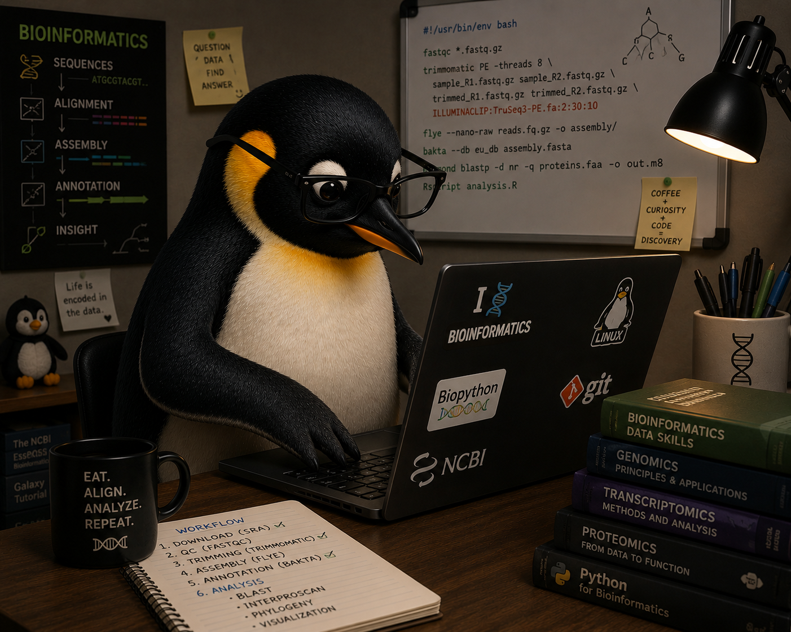

  <h3> <b>Hi, I'm Luccas Badiani! :dna: </b></h3> 
  Bachelor's student in Biophysics at the Federal University of Rio de 
  Janeiro with a strong interest in Bioinformatics,
  Multi-omics and Data Science applied to the life and health sciences. 

  <h3> <b>What I'm working on now</b> </h3>
  <ul>
     <li> Co-developing a Metagenomics pipeline for pathogen detection and genomic surveillance </li>
     <li> Currently expanding my knowledge in <b>Data Science</b>, building expertise in Python, POO, R, SQL, Statistics, and Machine Learning while developing
          practical data-driven projects </li>
    <li>  Conducting research in <strong>Proteomics</strong> and <strong>Toxinology</strong>, integrating <strong>Bioinformatics</strong> approaches for the
          analysis and interpretation of omics datasets.</li> </li>   
  </ul>

<h3> Tools I work with </h3>

